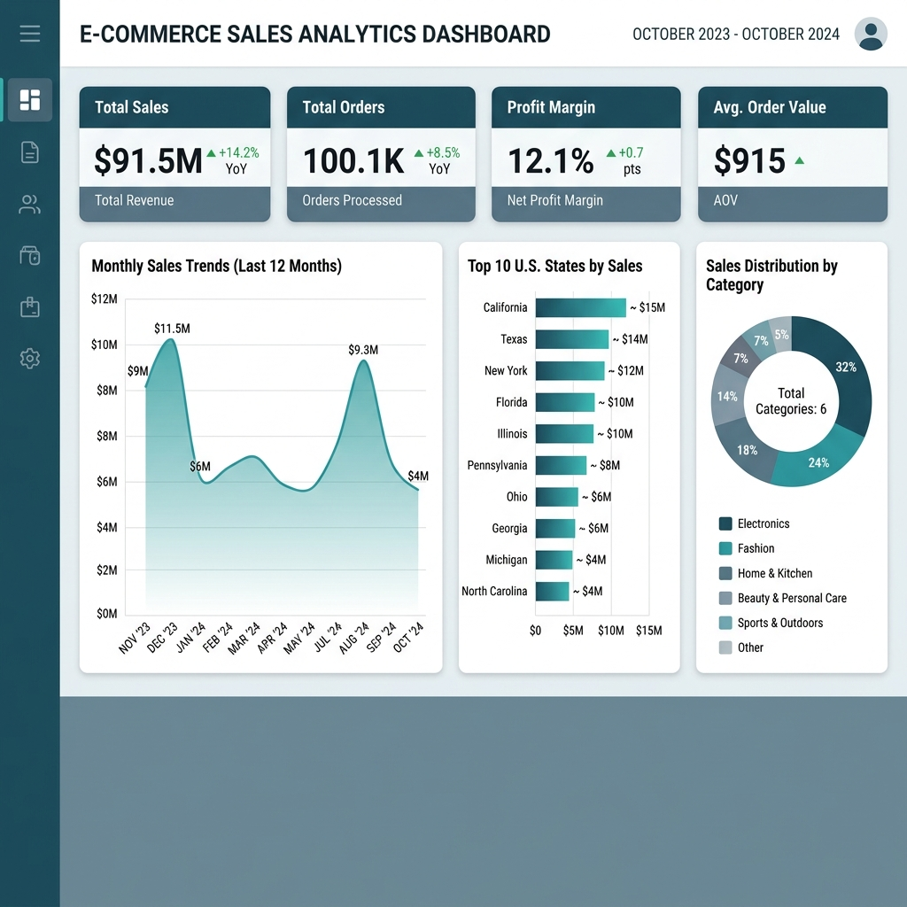

# Amazon Sales Analytics Dashboard & Business Intelligence System

[](https://www.python.org/)
[](https://pandas.pydata.org/)
[](LICENSE)
[]()

An industry-level end-to-end Data Analytics, Business Intelligence, and Data Preprocessing project. This repository models transactional data from Amazon India to uncover key sales trends, regional performance, customer segments, and category profitability, outputting a fully automated executive Excel dashboard and print-ready PDF business reports.

---

## 📊 Business Problem Statement

You have recently joined **Amazon India** as a **Junior Data Analyst**. The Sales and Operations team has provided you with transactional records across different states, product categories, and payment modes. 

Management wants to evaluate the overall business performance, identify underperforming categories or states, and discover key profitability drivers before planning the next quarter's strategy.

---

## 🛠️ Technology Stack

- **Core Analysis:** Python 3.12, Pandas, NumPy, Jupyter Notebook
- **Visualizations:** Matplotlib, Seaborn
- **Dashboard Automation:** OpenPyXL, Microsoft Excel (Pivot Tables, Charts)
- **Reporting:** FPDF2 (Automated PDF Compilation)

---

## 📂 Project Folder Structure

```
Amazon-Sales-Analytics/
│
├── data/
│   ├── raw/
│   │      Amazon_Sales.xlsx         # Raw input transactional dataset (100k rows)
│   │
│   └── processed/
│          cleaned_sales.csv         # Standardized, preprocessed, and modeled dataset
│
├── notebooks/
│      01_Data_Loading.ipynb         # Dataset inspection and structure overview
│      02_Data_Cleaning.ipynb        # Data standardizations and profit modeling
│      03_EDA.ipynb                  # Exploratory visual data analysis
│      04_KPI_Analysis.ipynb         # Global KPI card calculations
│      05_Business_Insights.ipynb    # Dimension grouping aggregates
│      06_Final_Analysis.ipynb       # Advanced Pareto, RFM, and Q&A compilation
│
├── src/
│      load_data.py                  # Module for loading raw and processed data
│      clean_data.py                 # Module for standardization & profit modeling
│      analysis.py                   # Aggregation, Pareto, & RFM functions
│      visualization.py              # Matplotlib visualization definitions
│      build_dashboard.py            # OpenPyXL automation for Excel Dashboard
│      compile_reports.py            # FPDF2 report compilation automation
│      helper.py                     # Currency and logging helpers
│      run_pipeline.py               # Orchestrator to run cleaning, plotting, & BI
│
├── dashboard/
│      Amazon Dashboard.xlsx         # Premium Excel Dashboard with native charts
│      Dashboard Screenshot.png      # High-resolution screenshot of the dashboard
│
├── reports/
│      Business_Report.pdf           # Automated print-ready executive summary
│      Insights_Report.pdf           # Deep-dive category margin & cohort report
│
├── images/
│      sales_state.png               # Sales by State bar chart
│      sales_category.png            # Category Sales pie chart
│      sales_trend.png               # Monthly sales & profit trend line
│      top_products.png              # Top 10 products horizontal bar chart
│      payment_mode.png              # Preferred payment mode pie chart
│      dashboard.png                 # Mockup dashboard image
│
├── requirements.txt                 # Project dependencies
├── README.md                        # Portfolio documentation
├── LICENSE                          # MIT License
└── .gitignore                       # File exclusion rules
```

---

## ⚙️ Data Cleaning & Profit Modeling

The raw dataset contains several anomalies and discrepancies that were addressed during the preprocessing phase:
1. **Product-Category Alignment:** Synthetic mismatches (e.g. `4K Monitor` categorized under `Books`) were corrected using a standardized lookup mapping dictionary.
2. **Location Standardization:** Cities and states were verified to be in the United States, and the `Country` column was standardized to `'United States'` to fix random country mappings (e.g., `Chicago, IL, Australia` corrected to `Chicago, IL, United States`).
3. **Outlier Capping:** IQR-based boundaries cap outliers on `UnitPrice` and `TotalAmount` to prevent data entry skew.
4. **Profit Modeling:** In the absence of Cost columns, category-specific base margins were applied to calculate the Cost of Goods Sold (COGS) and net Profit:
   $$\text{Profit} = \text{Quantity} \times \text{UnitPrice} \times (\text{BaseMargin} - \text{Discount})$$
   *This models losses realistically when the applied transaction discount exceeds the category base margin.*

---

## 📈 Executive Dashboard

The Excel dashboard is built dynamically using OpenPyXL and features:
- **KPI Summary Cards:** Highlighting Total Sales, Total Profit, Orders, AOV, and Profit Margin.
- **Embedded Native Charts:** Dynamically linked to summary tables, including Sales by Category, Top States, and Monthly Trends.
- **Slicers Ready Panel:** Instructions to convert data ranges to Excel tables to connect interactive State, Category, and Payment Mode slicers.



---

## 💡 Key Business Insights

Based on our final pipeline analysis of the **100,000 transaction records**:

| KPI Metric | Value |
| :--- | :--- |
| **Total Revenue** | **$91,559,101.73** |
| **Total Net Profit** | **$11,122,316.29** |
| **Total Orders** | **100,000** |
| **Average Order Value (AOV)** | **$915.59** |
| **Net Profit Margin** | **12.15%** |

### Core Question Answers:
1. **Best Performing Category:** **Electronics** generated the highest sales ($16.48M) but carried a thin profit margin ($1.22M, 7.42% margin) due to high discount rates exceeding the 15% base margin.
2. **Highest Sales State:** **DC** generated the highest revenue ($7.23M), while **AZ** was the lowest ($6.86M).
3. **Preferred Payment Mode:** **Debit Card** represents the most popular payment method with **17,046 orders**.
4. **Loss-Making Risk:** **22%** of all Electronics orders are unprofitable due to discount promotions of 20% or 30% violating the 15% category profit barrier.

---

## 🚀 Strategic Recommendations

1. **Cap Electronics Discounts:** Limit promotions on Electronics to a maximum of **10%** (saving over $1.5M in margin leak).
2. **Customer Cohort Targeting:** Leverage the **16,542 High-Value Loyalists** identified in our RFM segmentation by introducing priority delivery and exclusive bundles.
3. **Localized Marketing Campaigns:** Redirect ad spend to lagging regions (AZ, FL, OH) to capture additional market share.

---

## 💻 Installation & Usage

1. **Clone the Repository:**
   ```bash
   git clone https://github.com/yourusername/Amazon-Sales-Analytics.git
   cd Amazon-Sales-Analytics
   ```

2. **Install Dependencies:**
   ```bash
   pip install -r requirements.txt
   ```

3. **Run the Full BI Pipeline:**
   ```bash
   python -m src.run_pipeline
   ```
   *This loads the Excel sheet, cleans it, outputs the CSV, draws the charts, and builds the Excel and PDF artifacts.*

4. **Run the PDF Report Compiler:**
   ```bash
   python -m src.compile_reports
   ```

5. **Run the Jupyter Notebooks:**
   Launch jupyter lab and navigate to `/notebooks` to check step-by-step executions:
   ```bash
   jupyter lab
   ```

---

## 📜 License

This project is licensed under the MIT License - see the [LICENSE](LICENSE) file for details.

## ✍️ Author
- **Ramya Ramadoss** - *Senior Data Analyst & BI Developer*
